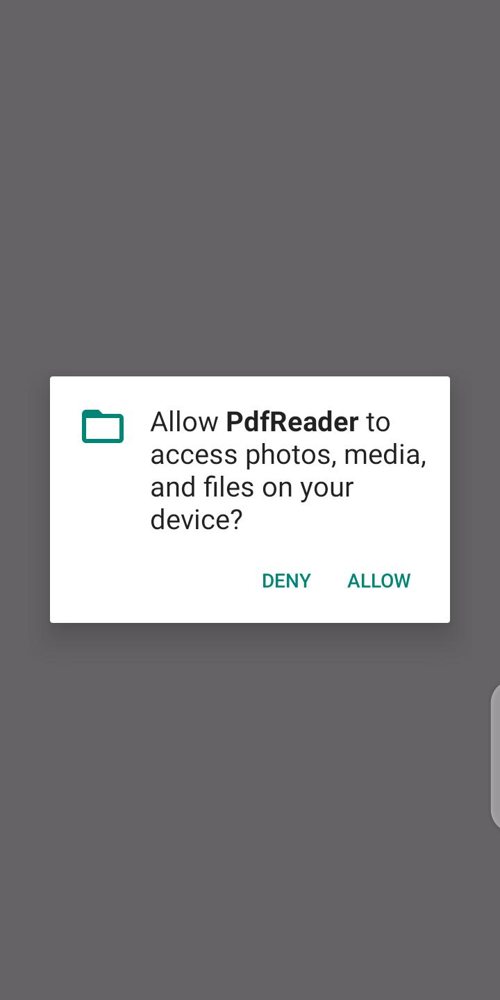
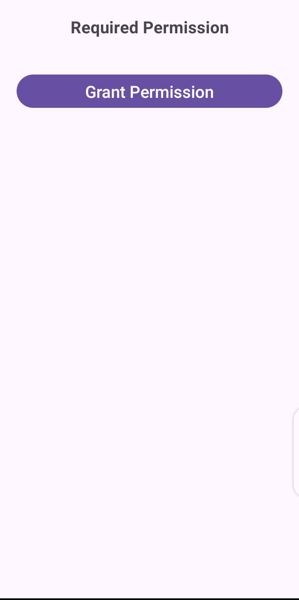
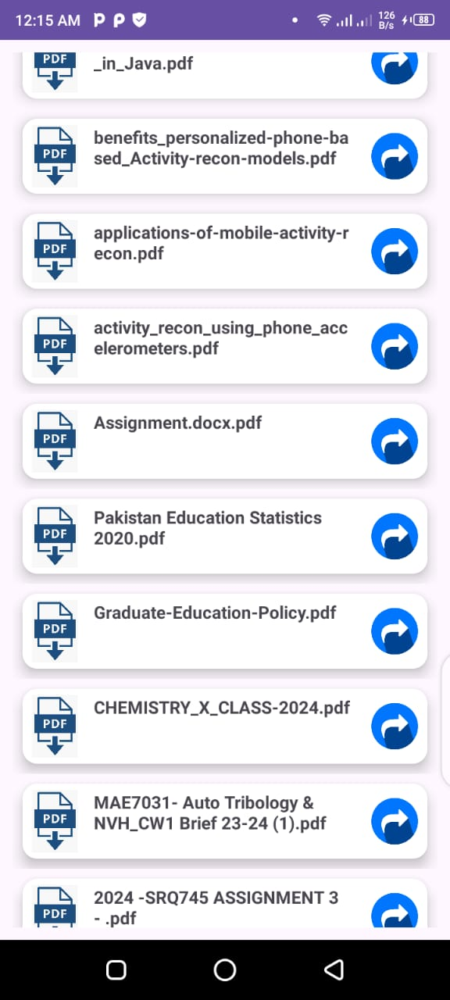
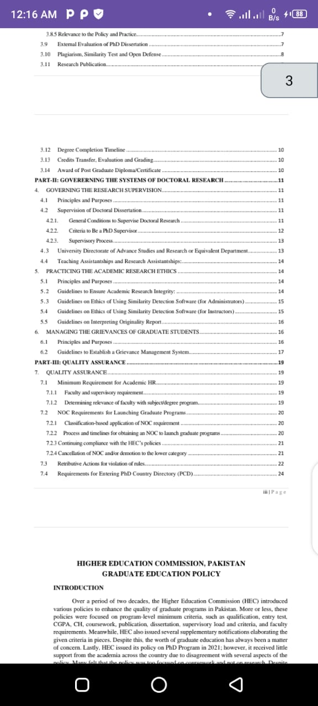
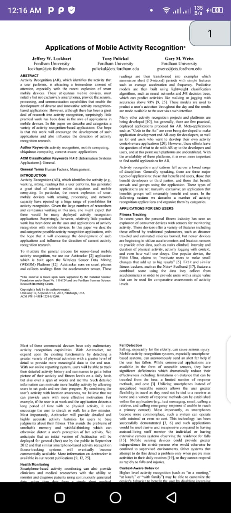
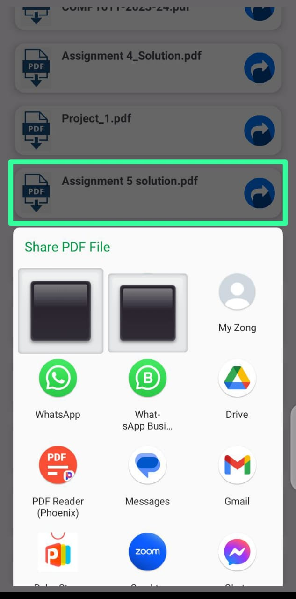

# PDF Viewer App
## Overview
###### The PDF Viewer App is a simple Android application designed to retrieve all PDF files from the device and display them in a RecyclerView. Users can view any PDF file by tapping on its RecyclerView item. Additionally, the app provides the functionality to share PDF files with other apps installed on the device.
## Features
###### Retrieve all PDF files from the device.
###### Display PDF files in a RecyclerView.
###### View PDF files within the app.
###### Share PDF files with other apps.
## Screenshots
######  
When App is Launched

###### 
When Permission is Denied

###### 
When permission is Granted, Displaying all the PDF files available

###### 
Reading the PDF files

###### 
When clicking on the share icon. The app shares the clicked pdf file.

## Contributions
###### Contributions to the PDF Viewer App are welcome! If you find any issues or have suggestions for improvements, feel free to open an issue or submit a pull request on GitHub.
